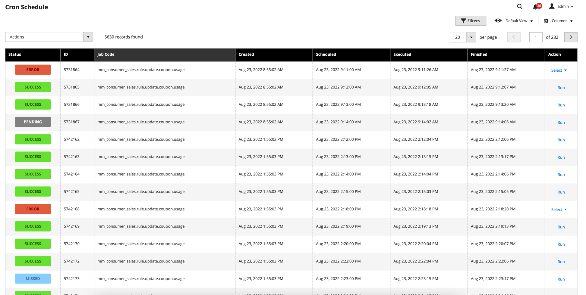
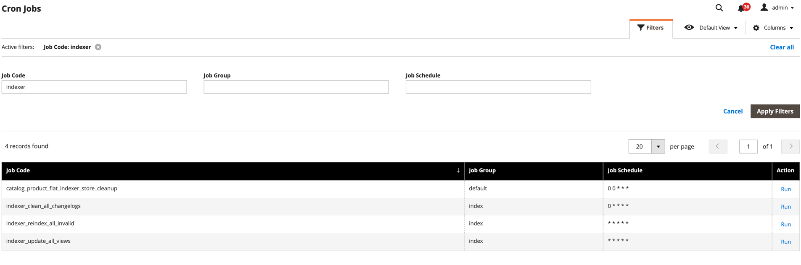
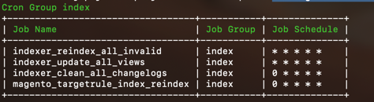

# Magento 2 Cron Extended Extension

## Requirements
* Magento 2.0.0-2.4.x

## Overview
Sometimes there is a circumstances when need to run one of the cron jobs manually, 
but Magento doesn't have this out of the box.
This extension allows you to run any cron jobs from Magento CLI or admin panel manually.

## Main Features
* Cron Schedule List in Magento Admin
* Table of all configured cron jobs
* Run any cron jobs from Magento Admin
* Run any cron jobs from Magento CLI
* Get list of all cron jobs from Magento CLI with possibility to filter them by group or code
* ACL (Access Control List) added

## Installation
```bash
composer require halexm2/cron-extended
bin/magento setup:upgrade
```

## CLI Commands
```bash
bin/magento cron:extended:run --job="[JOB_CODE]"
bin/magento cron:extended:list --group_filter="[GROUP_NAME]" --job_filter="[JOB_CODE]"
```

#### Usage Example
```bash
bin/magento cron:extended:run --job="indexer_reindex_all_invalid"
bin/magento cron:extended:list --group_filter="index"
```

## Screenshots
### Schedule list in Magento Admin


### Jobs list in Magento Admin


### Cron Jobs list in CLI
```bash
bin/magento cron:extended:list --group_filter="index"
```


### Running Cron Job from CLI
```bash
bin/magento cron:extended:run --job="indexer_reindex_all_invalid"
```
